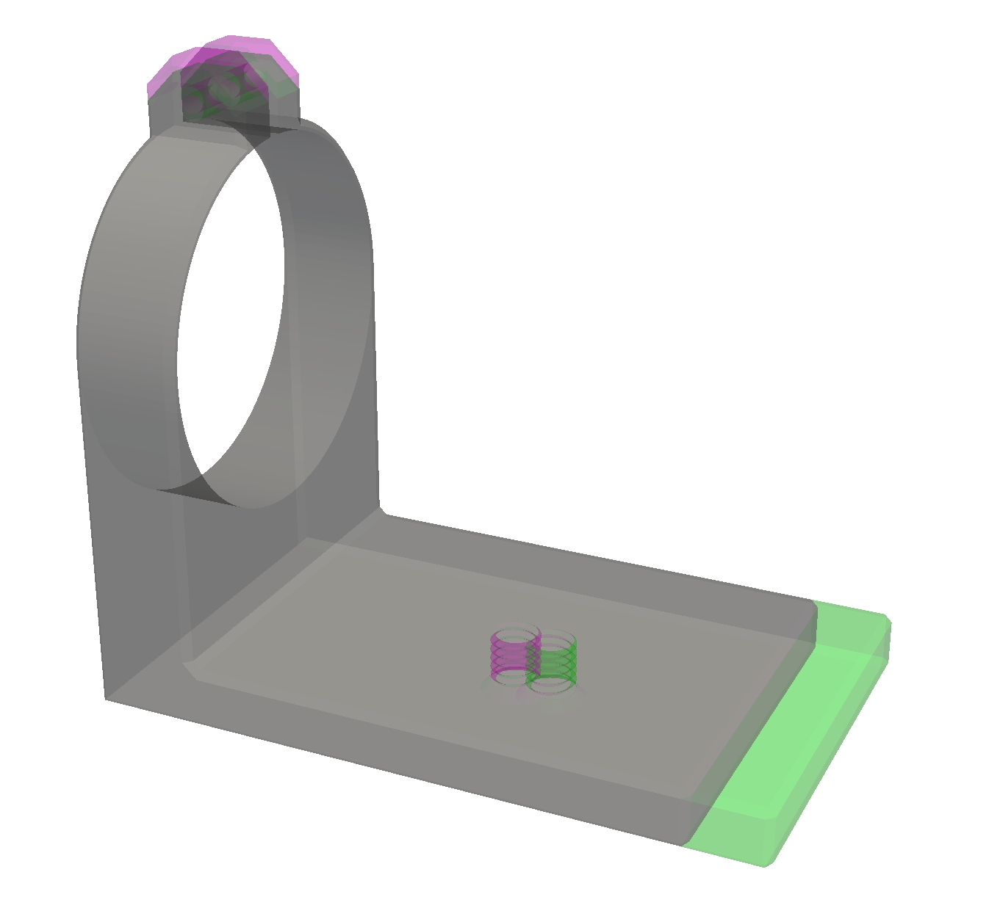

This Python program provides a simple and robust way to compare 3d
files such as STL, OBJ, 3MF, and STEP. The unchanged parts of the
objects are shown in gray, while the changed parts are shown in
contrasting colors that stand out, as in the following example.

In this example most of the lens clamp is unchanged and is displayed
in gray, while the differing parts are displayed in red for one file
and green for the other file. In the red file the tabs were longer,
while in the green file the base was longer, and the threaded hole has
been moved.

Installation

Supported formats

Color schemes

API

How it works
