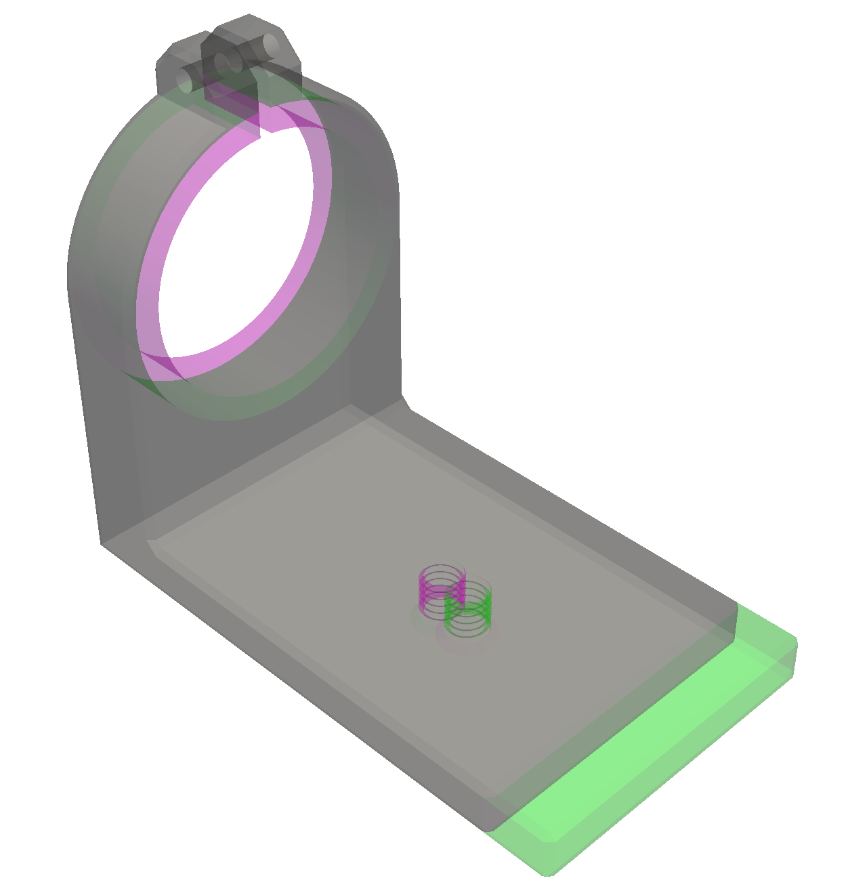
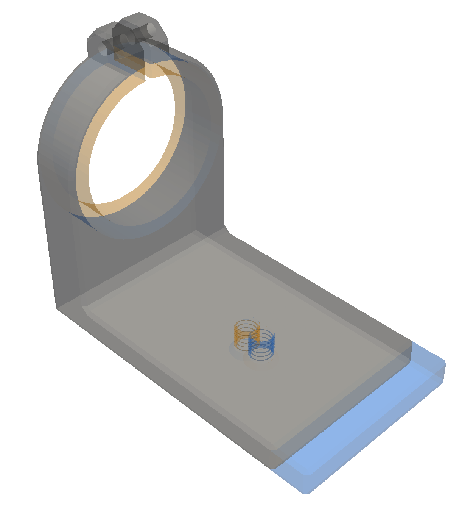
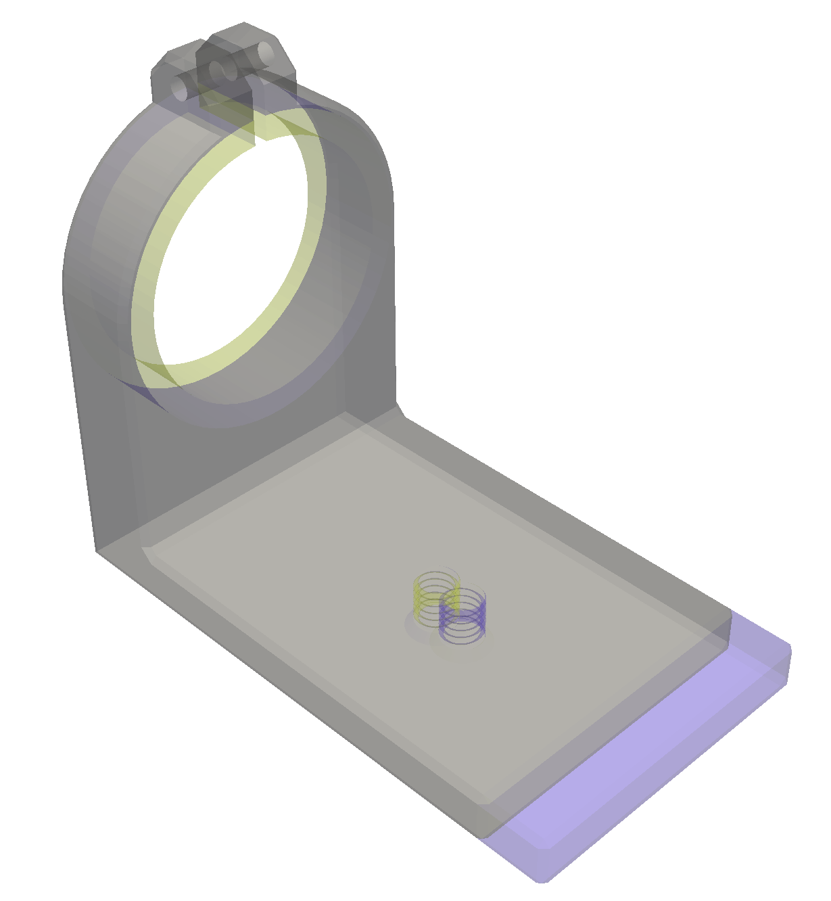

This Python program provides a simple, fast, and robust way to visually
compare 3d files such as STL, OBJ, 3MF, and STEP. The unchanged parts
of the objects are shown in gray, while the changed parts are shown in
contrasting colors that stand out, illustrated by the following
example.

In this example most of the lens clamp is unchanged and is displayed
in gray, while the differing parts are displayed in red for one file
and green for the other file: in the red file the diameter is smaller,
while in the green file the base is longer, and the threaded hole has
moved.

### Quick start

    git clone https://github.com/bdlucas1/diff3d
    cd diff3d
    pip install -r requirements.txt
    python diff3d.py examples/lens-clamp-A.stl examples/lens-clamp-B.stl

Note that if you have Python installed but don't happen to have git you
can just download the files individually from github. All you reall need
is to download `diff3d.py` and to `pip install pyvista`.  If there is enough
interest I'll look into publishing this as a pip-installable package.

The diff3d command may take up to about a minute to run the first time
while it loads and compiles the supporting packages, but after that
the startup time will be very quick.

You can drag the displayed object to rotate it, use the mouse wheel to
zoom, and shift-drag to pan.

The second file is optional, in which case the first file will simply
be displayed without diffs. This allows the tool to be used as a
simple 3d file viewer in addition to its primary function.

### Supported platforms, file formats, and object types

I have only tested this on MacOS with Python 3.12 and 3.13, but as far
as I know it should work on Windows and Linux. If you have information
about the status of those platforms please let me know.

Out of the box diff3d supports STL, OBJ, and 3MF files. Support for a
number of additional file types is available by installing `meshio`,
and support for STEP files can be enabled by installing `build123d`.

Unlike other tools that do 3d diffs by using 3d boolean operations
like intersection and difference, this tool is robust and is not
limited to manifold (closed surface) meshes, but can diff anything that
can be rendered, including open surfaces, curves, and points.

### Color schemes

Three color schemes designed to be colorblind-friendly are
provided. (This is based on information from
https://davidmathlogic.com/colorblind, and I have not verified
this. If you have information to add please contact me by opening an
issue on github.)

You can choose a scheme using the `-s` or `--scheme` option.  The
above schemes are named "1", "2", and "3" respectively.

### API

The diff3d module provides a simple API if you want to integrate it
into your own program. See the code for details.

* `diff3d.from_files` opens a window displaying the diff between two files

* `diff3d.diff` opens a window displaying the diff between two pyvista objects.

* If you are using a different mesh or CAD package, if you can obtain
  point and triangle arrays, you can convert them to pyvista objects
  using `pyvista.PolyData.from_regular_faces`
